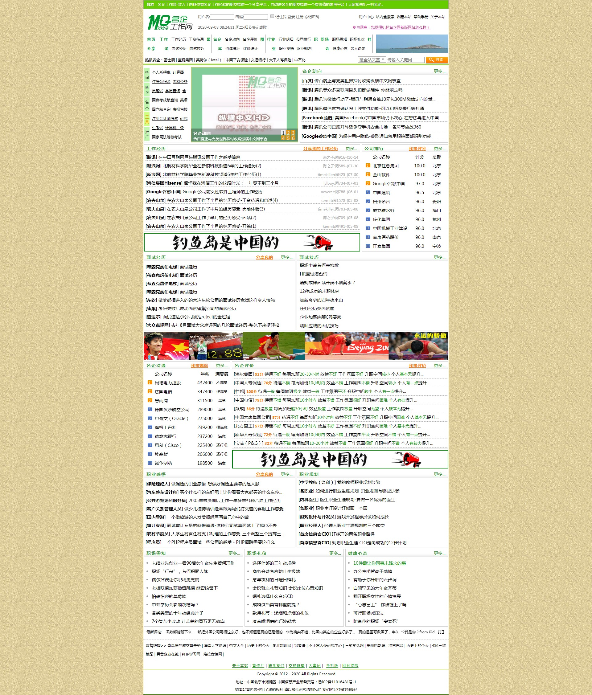

# work-experience-website
work-experience-website remain some php class file
此网站（原名：名企工作网）为2011年至2012年期间花费了很多心血完全独立写成的一个完整网站，包括整个网站前后端、以及功能丰富的后台功能、并对外网进行了很多文章、评价数据、待遇数据进行了抓取发布，内附网站界面图，网站主要收集是在一些知名企业的工作经历文章、工作面试文章、职场相关的知识，以及大家对企业的评价和透露的薪资待遇数据。

放在此GITHUB上的主要是网站里用到的php工具类，以及一些数据库表、邮件模板。这些可能还能用到。另外有一个调查的展示、投票结果页（含sql文件）
